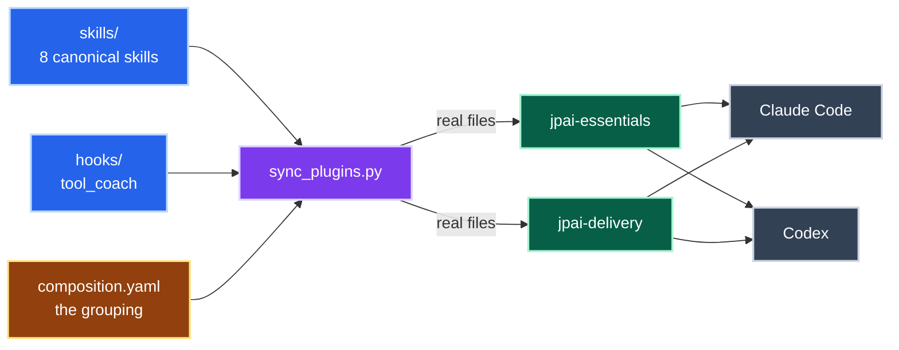
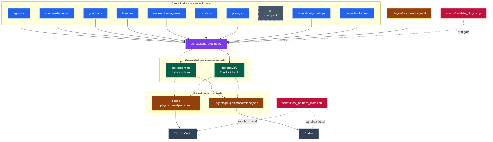

# skills

Agent skills published by [jpeak.ai](https://github.com/jpeakai).
Each directory under `skills/` is one skill: a `SKILL.md` carrying YAML frontmatter, plus whatever resources, scripts and templates it needs.

The skills are published as two installable plugins, so you take the pack you want rather than all of them:

| Plugin | For | Contains |
|---|---|---|
| [`jpai-essentials`](plugins/jpai-essentials) | Documentation and diagrams | `librarian`, `gooddocs`, `mermaidjs-diagrams`, `richdocs`, `concise-decisions`, `agnostic` |
| [`jpai-delivery`](plugins/jpai-delivery) | Delivery planning | `plan-gap`, `concise-decisions` |

Both packs ship the `tool_coach` PreToolUse hook.

## Installing

The two plugin marketplaces install a whole pack and its hook.
The other three routes give you finer control, down to a single skill.

### Claude Code

`.claude-plugin/marketplace.json` registers this repo as a [plugin marketplace](https://code.claude.com/docs/en/plugin-marketplaces).

```
/plugin marketplace add jpeakai/skills
/plugin install jpai-essentials@jpeakai
/plugin install jpai-delivery@jpeakai
```

### Codex

`.agents/plugins/marketplace.json` is the repo-scoped marketplace Codex looks for.

```sh
codex plugin marketplace add jpeakai/skills
codex plugin add jpai-essentials@jpeakai
codex plugin add jpai-delivery@jpeakai
```

### npx skills

[`npx skills`](https://github.com/vercel-labs/skills) treats any GitHub repo as the registry, and installs skills into whichever agents it finds.

```sh
npx skills add jpeakai/skills --list              # the eight skills, nothing installed
npx skills add jpeakai/skills --skill librarian
npx skills add jpeakai/skills --skill '*' --global
```

It resolves the canonical `skills/` tree rather than the packs, so it reaches `cli` but brings no hook.
Skills land in the current project unless `--global` sends them to your user directory.
Afterwards `npx skills list`, `update` and `remove` manage what it installed.

### apm

[`apm`](https://github.com/microsoft/apm) is a dependency manager for agents, and takes either a pack or a single skill.

```sh
brew install apm    # or: curl -sSL https://aka.ms/apm-unix | sh

apm install jpeakai/skills/plugins/jpai-essentials --target claude,codex
apm install jpeakai/skills --skill librarian
```

The pack form deploys the hook too, once per target.
The `--skill` form takes one skill by name out of the canonical tree.
Either way the dependency lands in your `apm.yml` and what resolved is recorded in `apm.lock.yaml`, so a bare `apm install` reproduces it.
Suffix the source with `#<sha>` to pin the ref, otherwise apm warns that it is tracking the default branch.

### Manually

Copy or symlink a skill into your agent's skills directory:

```sh
git clone https://github.com/jpeakai/skills.git
ln -s "$PWD/skills/librarian" ~/.claude/skills/librarian
```

[`cli`](skills/cli) is in neither pack, so this and the two skill-level routes above are the only ways to get it.

## The skills

| Skill | Pack | What it does |
|---|---|---|
| [`agnostic`](skills/agnostic) | essentials | Keeps documentation generic by renaming project-, client- or company-specific names to open-source-style placeholders |
| [`cli`](skills/cli) | none | Playbook for building project-local developer CLIs and the assets they generate: static HTML viewers, workflow templates, stencil diagrams, sticky PR comments |
| [`concise-decisions`](skills/concise-decisions) | both | Consolidates accumulated ambiguities into a single highest-leverage decision question, answering first from existing decision records |
| [`gooddocs`](skills/gooddocs) | essentials | Documentation quality in three modes: audit docs against the reality of the code, write or improve them, or restructure one for readability |
| [`librarian`](skills/librarian) | essentials | Repo documentation organisation: ensures the canonical document set exists and every doc lives where its content says it belongs |
| [`mermaidjs-diagrams`](skills/mermaidjs-diagrams) | essentials | Renders and analyses Mermaid diagrams in markdown, enforcing visual complexity limits and WCAG colour-contrast requirements |
| [`plan-gap`](skills/plan-gap) | delivery | Gap analysis planning: iteratively refines a tiered spec covering execution plan, gaps, decisions, and success and negative measures |
| [`richdocs`](skills/richdocs) | essentials | Rich HTML companions to markdown discovery documents, with a vendored draw.io stencil library and an injectable design-tokens brandpack |

## Layout

`skills/` and `hooks/` are canonical.
The packs under `plugins/` are **generated** from them.
[`plugins/composition.yaml`](plugins/composition.yaml) declares what each pack composes, and `scripts/sync_plugins.py` copies it in.



*Edit blue, declare amber, never touch green.* Both packs install into both agents.

<details>
<summary>📋 Complete diagram — every skill, both marketplaces, and the gates</summary>



`cli` sits in the canonical tree with no edge out: it is installed manually. `concise-decisions` is the one skill that flows into both packs.

</details>

```
skills/          canonical skills, one directory each   ← edit here
hooks/           canonical hook, its rules and tests    ← edit here
plugins/         generated packs, two manifests each    ← never edit
  composition.yaml   which skills go in which pack
scripts/         sync, validate, and harness install test
```

Copies rather than symlinks, because Codex drops symlinked plugin components and installs an empty pack without erroring.
Git deduplicates the copies by content hash, so the repository barely notices.
The reasoning is in [plugins/README.md](plugins/README.md#why-copies-and-not-symlinks).

To change a skill, edit it under `skills/` and re-sync:

```sh
make fix          # mirror the canonical trees into the packs
make ci           # assert the mirror is committed, then run every layout invariant and the hook suite
make docs-ci      # prose, diagram-complexity and colour-contrast gates over the authored markdown
make harness-ci   # install both packs into throwaway Claude and Codex sandboxes
```

## Hooks

### tool_coach

A `PreToolUse` hook that turns a dead-end "permission denied" into a redirect.
Every blocked call comes back with the thing to do instead, so the model stops retrying near-miss variants.
Structural checks (no deletions, no scratch space outside the project) parse the command's argv; tool-choice coaching lives in an editable rules file.
Stdlib only: no install, no virtualenv.

It is written once, in [`hooks/`](hooks), and mirrored into both packs by the same [`hooks/hooks.json`](hooks/hooks.json): installing either plugin brings it along.
See [hooks/README.md](hooks/README.md) for what it checks and how the one wiring file works for both Claude Code and Codex.

```sh
uv run --no-project --with pytest pytest hooks/test_tool_coach.py
```

## Licence

MIT. See [LICENSE](LICENSE).
