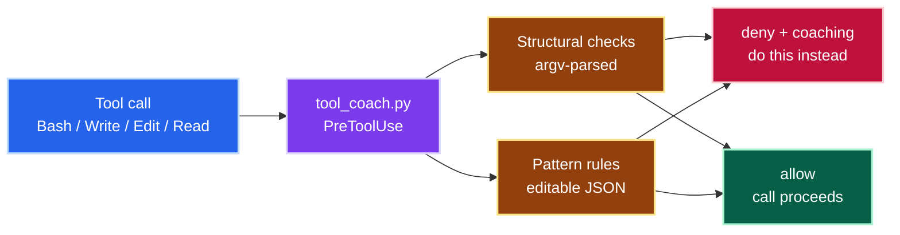
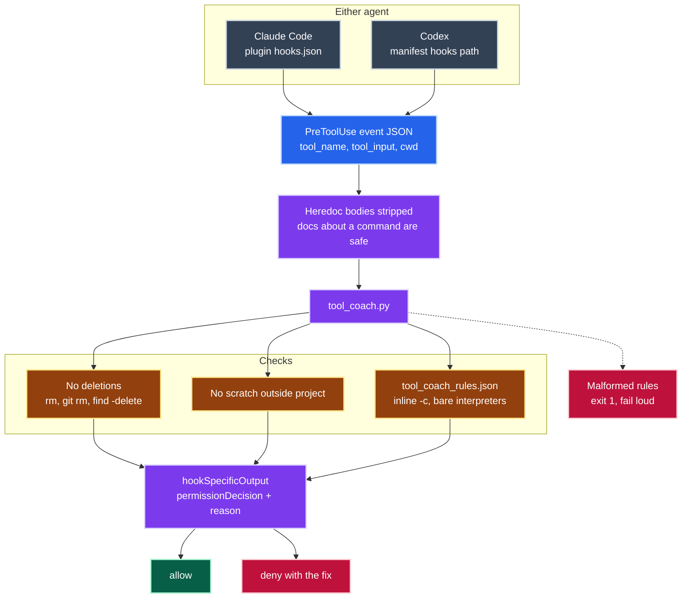

# hooks/

A `PreToolUse` guardrail hook, wired once and shared by both ecosystems this
repo publishes a plugin for: **Claude Code** and **Codex CLI**.

## What it does

**`tool_coach.py`** reads the PreToolUse event on stdin and, when a tool call
breaks one of this repo's working agreements, returns a `deny` decision whose
*reason* is a coaching message saying what to do instead. A plain "permission
denied" teaches nothing and invites the model to retry near-miss variants; a
redirect ends the loop in one turn.

| Check | Kind | Applies to |
|-------|------|------------|
| No deletions | structural | Bash |
| No out-of-project scratch space | structural | Bash, Write, Edit, NotebookEdit, Read |
| Tool-choice coaching (inline `-c` snippets, bare interpreters, manual `PYTHONPATH`, the `timeout` binary) | pattern rules in `tool_coach_rules.json` | Bash |



*A denial carries a redirect, not a dead end.* Same shape in both agents.

<details>
<summary>📋 Complete diagram — the checks, the wire format, and both harnesses</summary>



Both agents send the same event shape and read the same decision back, which is
why one script serves both. Failure is loud: a broken rules file exits 1 rather
than silently allowing the call.

</details>

Structural checks parse the command into argv with `shlex`, so they catch
wrapped and indirect forms a regex misses: `sudo`, `xargs`, an absolute
`/bin/` path, an env-var prefix, a pipeline, `git rm`, `find -delete`. Pattern
rules live in the JSON file and need no code change to add. Heredoc bodies
are stripped before any check runs, so writing *documentation about* a
blocked command is never itself blocked. Full behaviour and rationale are in
the module docstrings of `tool_coach.py` and `tool_coach_rules.json`.

Stdlib only (`json`, `os`, `re`, `shlex`, `sys`, `pathlib`) — nothing to
install, no virtualenv to resolve, on every call in either agent.

## Provenance

`tool_coach.py`, `tool_coach_rules.json`, `test_tool_coach.py` and
`conftest.py` are vendored, unmodified in logic, from
[`neozenith/agentic-dotfiles`](https://github.com/neozenith/agentic-dotfiles)
(MIT licensed) — only doc comments were added here to note that origin and
this file (`hooks/README.md`) plus `hooks.json` are new. All credit for the
hook's design and test suite belongs to that repo.

## What's portable, and why

This directory is the plugin-facing, ecosystem-agnostic core: two stdlib
Python scripts and a JSON rules file. Neither reads a Claude- or
Codex-specific API — they only read the hook's stdin JSON and print a JSON
decision to stdout, using field names ( `tool_name`, `tool_input`, `cwd` on
the way in; `hookSpecificOutput.{hookEventName,permissionDecision,
permissionDecisionReason}` on the way out) that turn out to be the *same*
wire shape in both agents for `PreToolUse` today. That's the "portable" part.

The wiring is `hooks/hooks.json`, one file registering the script against
the `PreToolUse` event with a matcher — and it, too, is shared verbatim:

```jsonc
// hooks/hooks.json
{
  "hooks": {
    "PreToolUse": [
      {
        "matcher": "Bash|Write|Edit|NotebookEdit|Read",
        "hooks": [
          {
            "type": "command",
            "command": "python3 \"${CLAUDE_PLUGIN_ROOT}/hooks/tool_coach.py\"",
            "timeout": 10,
            "statusMessage": "Checking the call against this project's working agreements…"
          }
        ]
      }
    ]
  }
}
```

### Claude Code

This is the documented plugin convention: a plugin's `hooks/hooks.json` is
auto-discovered at the plugin root and merged into the session's hook
config when the plugin is enabled — no reference from `plugin.json` needed,
the same way `skills/` is auto-discovered. `${CLAUDE_PLUGIN_ROOT}` resolves
to this plugin's install directory. (Confirmed against
[Claude Code plugin docs](https://code.claude.com/docs/en/plugins) and
[hooks reference](https://code.claude.com/docs/en/hooks), September 2026.)

### Codex CLI

Codex CLI ships its own hooks engine (`codex-rs/hooks`, `codex-rs/plugin`,
`codex-rs/config::hook_config` in
[`openai/codex`](https://github.com/openai/codex)) that mirrors Claude
Code's `PreToolUse` contract closely enough to be wire-compatible:

- Same event name (`PreToolUse`), same handler shape
  (`{"type": "command", "command", "timeout", "statusMessage"}`).
- Same output shape: `hookSpecificOutput.hookEventName` /
  `.permissionDecision` (`allow` / `deny` / `ask`) /
  `.permissionDecisionReason` — verified against Codex's own generated JSON
  Schema fixture (`codex-rs/hooks/schema/generated/pre-tool-use.command.output.schema.json`
  at commit `1e66885a`).
- Codex's hook-command executor explicitly sets **`CLAUDE_PLUGIN_ROOT`** in
  the child process environment alongside its own `PLUGIN_ROOT`, with the
  code comment *"For OOTB compat with existing plugins that use this env
  var"* (`codex-rs/hooks/src/engine/*`). That is a deliberate
  interoperability decision on Codex's side, not an assumption made here.
- The plugin manifest loader (`codex-rs/core-plugins/src/manifest.rs`,
  `RawPluginManifestHooks`) accepts a `hooks` field in
  `.codex-plugin/plugin.json` as a bare path string, an array of path
  strings, or an inline hooks object — mirroring exactly how `skills`,
  `apps` and `mcpServers` already accept a bare string in this same file.
  Its own unit test parses `"hooks": "./hooks.json"` (a bare string) into a
  resolved hook file path, and a second fixture
  (`core-plugins/src/marketplace_tests.rs`) uses the array form,
  `"hooks": ["./hooks/session.json"]` — both resolve to the same
  `PluginManifestHooks::Paths` the loader then reads with
  `serde_json::from_str::<HooksFile>` (`core-plugins/src/loader.rs`), i.e.
  as plain JSON, the same encoding Claude Code's plugin `hooks/hooks.json`
  uses.

`.codex-plugin/plugin.json` in this repo declares
`"hooks": "./hooks/hooks.json"` — the bare-string form exercised by that
first unit test — so the one file above wires the one script into both
agents.

**Provenance note.** All of the above was established by reading Codex's
own source in the `openai/codex` repository (`codex-rs/hooks`,
`codex-rs/plugin`, `codex-rs/core-plugins`, `codex-rs/config::hook_config`,
commit `c9c7b73c`, September 2026), including its own unit tests exercising
the exact manifest shape used here — not from stable public documentation,
since `developers.openai.com/codex` (where OpenAI's own docs point for the
authoritative schema) was not reachable from the environment used for this
research. Treat the citations above as "confirmed by reading the shipped
source and its tests," not "guaranteed stable across future Codex
releases" — this is a fast-moving part of the codebase (for instance, the
`plugin-creator` sample skill bundled in that same checkout,
`codex-rs/skills/src/assets/samples/plugin-creator/scripts/validate_plugin.py`,
has its own separate, stricter scaffold-only validator whose `allowed_keys`
for `plugin.json` doesn't yet list `hooks` — that script is not the actual
plugin loader and doesn't gate what Codex will run, but it's a sign this
surface was added recently). If a future Codex CLI build stops reading
`.codex-plugin/plugin.json`'s `hooks` field, this hook simply won't be wired
for Codex until that's fixed; nothing else in this repo depends on it, and
the standalone install path below never depends on plugin-manifest support
either way.

### What is Claude-only

Nothing in the *hook itself* is Claude-only — that was the point of vendoring
stdlib-only scripts with no framework calls. Today, the wiring isn't
Claude-only either: both the Claude Code plugin convention and Codex's
manifest loader pick up `hooks/hooks.json` the same way, per the source
citations above. The only real risk is drift over time in a part of Codex's
codebase that is still actively changing — see the provenance note.

## Install

### As part of this repo's plugins (recommended)

Already wired — see the root [README](../README.md#installing). Installing
either `jpai-essentials` or `jpai-delivery`, in Claude Code or Codex, brings
this hook with it.

This directory is canonical. `scripts/sync_plugins.py` mirrors `hooks.json`,
`tool_coach.py`, `tool_coach_rules.json` and this README into each pack under
`plugins/`; the tests stay here and are not published. Edit the files here, then
re-run the sync — never edit the copy inside a pack.

### Standalone, in any other project

Claude Code (`.claude/settings.json`, or a project's own `hooks/hooks.json`
if it's itself a plugin):

```jsonc
{
  "hooks": {
    "PreToolUse": [
      {
        "matcher": "Bash|Write|Edit|NotebookEdit|Read",
        "hooks": [
          {
            "type": "command",
            "command": "python3 \"$CLAUDE_PROJECT_DIR/.claude/hooks/tool_coach.py\"",
            "timeout": 10,
            "statusMessage": "Checking the call against this project's working agreements…"
          }
        ]
      }
    ]
  }
}
```

Copy `tool_coach.py` and `tool_coach_rules.json` to `.claude/hooks/` in the
target repo (adjust the path in `command` to match).

## Failure behaviour

Fail **loud**, never open. A missing or malformed rules file prints one line
to stderr and exits 1, which the hook contract treats as a non-blocking
error: the model sees the message, the call proceeds, and the breakage stays
visible until it is fixed.

## Tests

```sh
pytest hooks/test_tool_coach.py
# or, with uv (the test file's PEP-723 header declares pytest itself):
uv run --no-project hooks/test_tool_coach.py --cov=tool_coach --cov-report=term-missing
```

52 cases, no mocks, real payloads through the real decision path.
