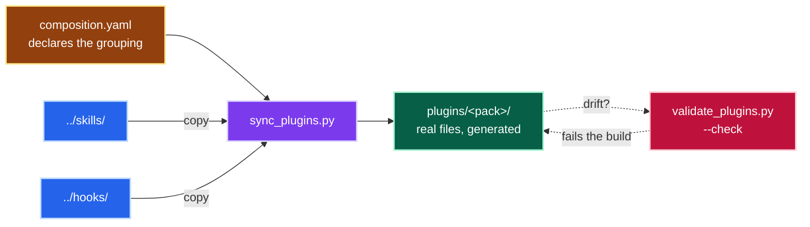
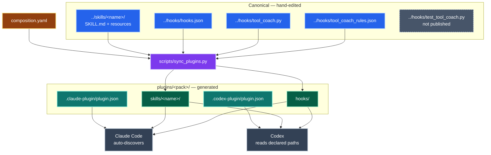

# plugins/

Installable packs, grouped by the job they do.
Everything here is **generated** from the canonical trees at the repo root.
See [Editing](#editing) before changing a file in this directory.

| Plugin | Skills | Hook |
|---|---|---|
| [`jpai-essentials`](jpai-essentials) | `librarian`, `gooddocs`, `mermaidjs-diagrams`, `richdocs`, `concise-decisions`, `agnostic` | yes |
| [`jpai-delivery`](jpai-delivery) | `plan-gap`, `concise-decisions` | yes |

`concise-decisions` is in both packs deliberately: it is the decision surface `plan-gap` asks its questions through, and it stands alone for documentation work.
Installing both packs is fine: each harness namespaces skills by plugin.

The `cli` skill is not in either pack.
It stays canonical in [`../skills/cli`](../skills/cli) and is installed manually; add it to a pack by naming it in [`composition.yaml`](composition.yaml).

## How a pack is built

`../skills/` and `../hooks/` are the source of truth. `composition.yaml` declares which skills each pack composes, and [`../scripts/sync_plugins.py`](../scripts/sync_plugins.py) copies them in.



*One direction only.* Content flows canonical → pack; the gate only ever reports.

<details>
<summary>📋 Complete diagram — what a pack contains and who reads which part</summary>



The two manifests are hand-written per pack; only `skills/` and `hooks/` are generated.
The hook test suite stays canonical and is deliberately not shipped.

</details>

### Why copies and not symlinks

Symlinks are the obvious way to compose packs from one canonical tree, and Claude Code handles them.
It follows links at load time and reports every skill.

Codex does not. `codex plugin add` copies the plugin into `$CODEX_HOME/plugins/cache/<marketplace>/<plugin>/<version>` and skips symlink entries, because its path handling refuses components containing a symlink.
The failure is silent and total: the plugin installs, reports `installed, enabled`, and carries an **empty** `skills/` directory.
Nothing errors on any surface.

So the packs hold real files.
The duplication is cheaper than it looks: git stores content addressed by hash, so every mirrored copy collapses onto the same object.
Mirroring all eight skill trees left `.git` *smaller* than before.
Five paths now carry `concise-decisions/SKILL.md`, and all five share one blob:

```
$ git ls-files -s '*concise-decisions/SKILL.md'
100644 08fb9432e72f5928d31a232b36169834c49d03ff 0  plugins/jpai-delivery/skills/concise-decisions/SKILL.md
100644 08fb9432e72f5928d31a232b36169834c49d03ff 0  plugins/jpai-delivery/skills/plan-gap/vendor/concise-decisions/SKILL.md
100644 08fb9432e72f5928d31a232b36169834c49d03ff 0  plugins/jpai-essentials/skills/concise-decisions/SKILL.md
100644 08fb9432e72f5928d31a232b36169834c49d03ff 0  skills/concise-decisions/SKILL.md
100644 08fb9432e72f5928d31a232b36169834c49d03ff 0  skills/plan-gap/vendor/concise-decisions/SKILL.md
```

Two of those five are `plan-gap`'s own vendored copy, which predates the packs.
They cost nothing either, for the same reason.

The cost is working-tree disk, not history.

## Editing

**Never edit a file under `plugins/*/skills/` or `plugins/*/hooks/`.** It is generated output, and the next sync overwrites it.

| To do this | Change this | Then run |
|---|---|---|
| Change a skill | `../skills/<name>/` | `uv run scripts/sync_plugins.py` |
| Change the hook | `../hooks/` | `uv run scripts/sync_plugins.py` |
| Add or remove a skill from a pack | [`composition.yaml`](composition.yaml) | `uv run scripts/sync_plugins.py` |
| Change a pack's name, version or blurb | that pack's two `plugin.json` files | `uv run scripts/validate_plugins.py` |

Each pack carries two manifests, one per ecosystem:

- `.claude-plugin/plugin.json` for Claude Code.
  Skills and hooks are auto-discovered, so it declares no paths.
- `.codex-plugin/plugin.json` for Codex.
  Declares `skills` and `hooks` explicitly, plus an `interface` block for presentation.

`validate_plugins.py` asserts the two agree on name and version, so a rename cannot land half-done.

## Checks

```sh
uv run scripts/sync_plugins.py --check   # mirror matches the canonical trees
uv run scripts/validate_plugins.py       # every layout invariant
./scripts/test_harness_install.sh        # real install into both harnesses
```

The last one clones HEAD into a temp directory, then installs both packs into a throwaway `CLAUDE_CONFIG_DIR` and a throwaway `CODEX_HOME`.
`HOME` is replaced as well, because Codex reads personal skills from `~/.agents/skills`, which `CODEX_HOME` does not cover.
It then asserts each skill reaches the model-visible prompt and that no external skill root leaked into the sandbox.
