# librarian architecture

How one `/librarian` invocation expands into work.
Each lens below has an overview that stays visible and a detailed reference you can expand.
The last section lists the permutation axes and the eval scenario that covers each one.

Colour key, shared by every diagram:

| Colour | Kind |
|---|---|
| Blue | Invocation and arguments |
| Violet | Authority and decisions |
| Green | Pipeline steps |
| Slate | Skill resources and scripts |
| Amber | Artifacts written or reported |
| Red | Forbidden outcomes |

## 1. Mode dispatch

Every mode runs Step 0 first, then branches on the first argument.

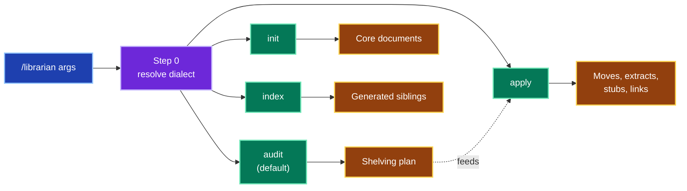

*Four modes, one shared dialect step.* Audit is the only read-only mode.

Complete diagram: arguments, resources and outputs per mode

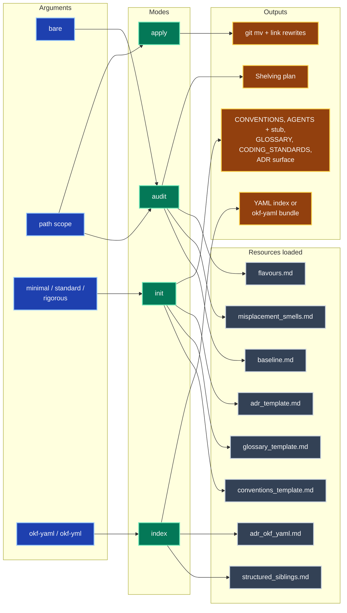

## 2. Dialect resolution

Every contested question is answered by the highest rung that has evidence, and the audit names the rung.

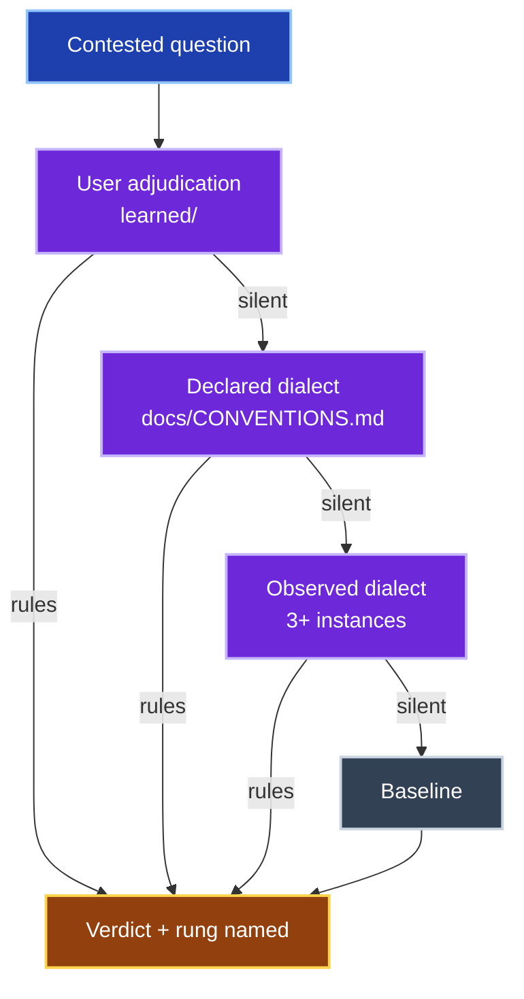

*User beats declared, declared beats observed, observed beats baseline.*

Complete diagram: named conventions, majority rule and forbidden findings

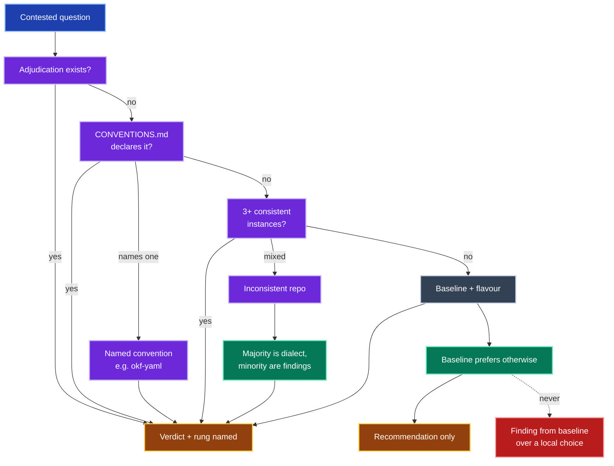

## 3. Audit pipeline

Read-only.
Charters come first, so every misplacement verdict cites one.

*Seven stages, no writes.*

Complete diagram: every check feeding the plan

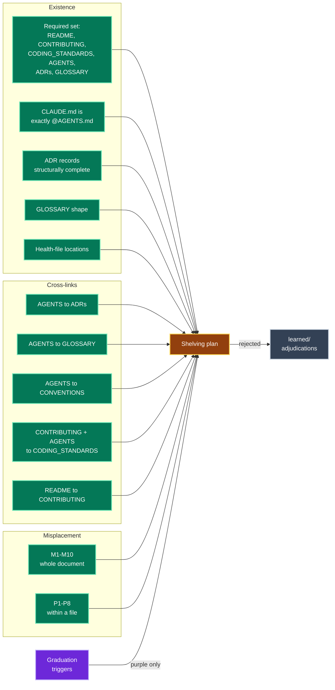

## 4. Apply operations

A closed set of seven operations, each loss-free.

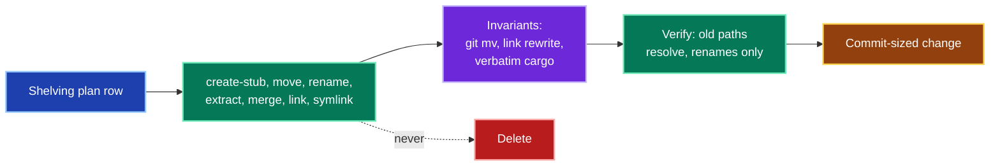

*Deletion is not in the vocabulary.*

Complete diagram: each operation and its guard

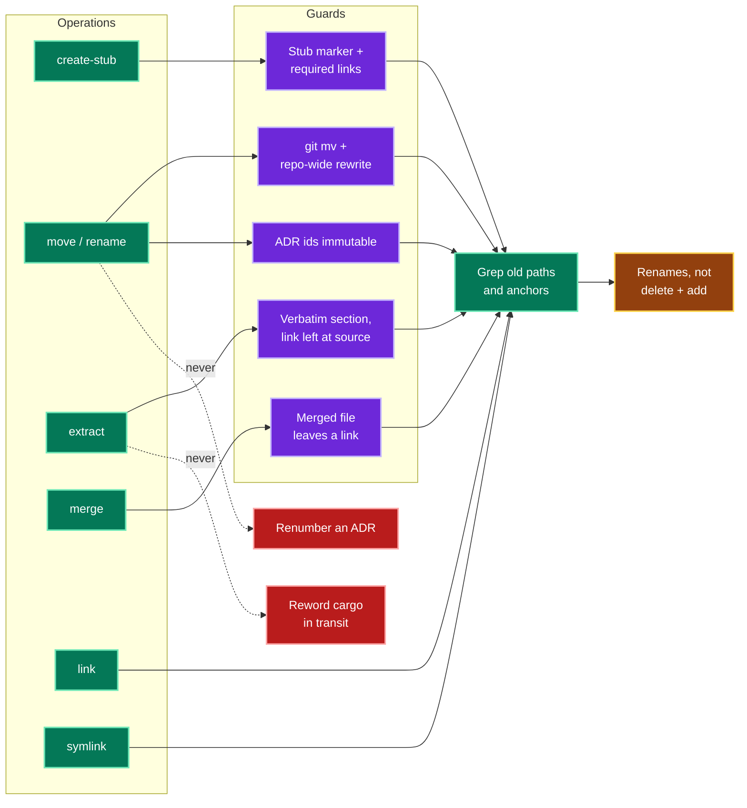

## 5. Init

A flavour sets the starting shape; observed practice overrides it line by line.

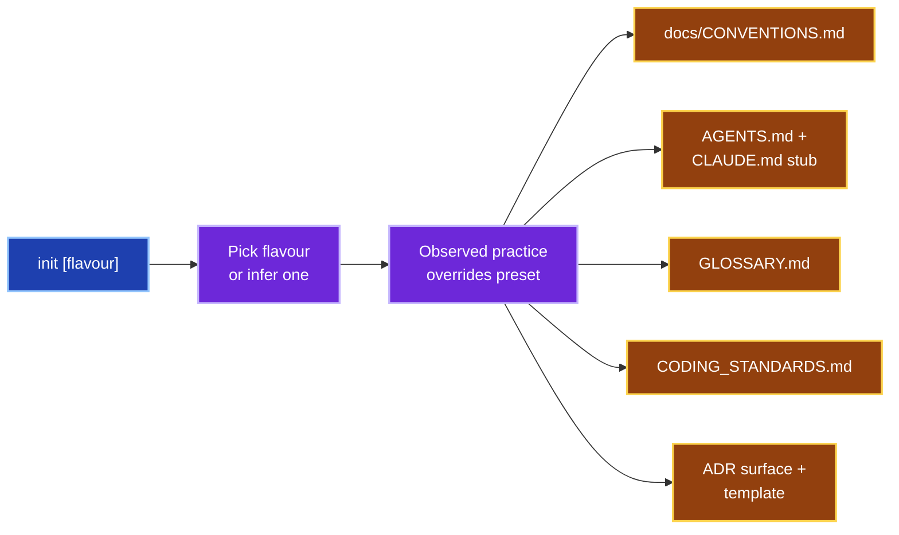

*Five core documents, each written only when missing.*

Complete diagram: flavours, templates and wiring

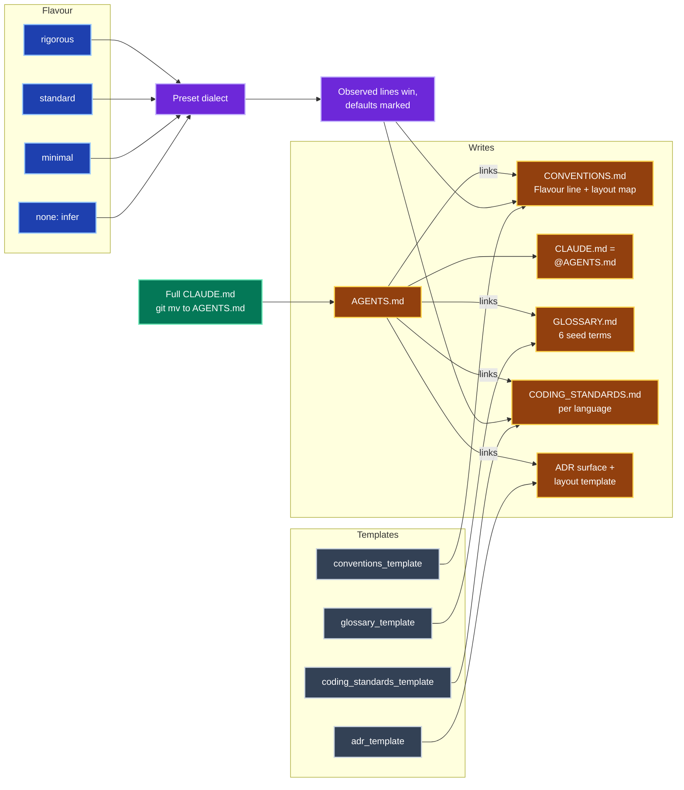

## 6. Index

No consumer, no index.

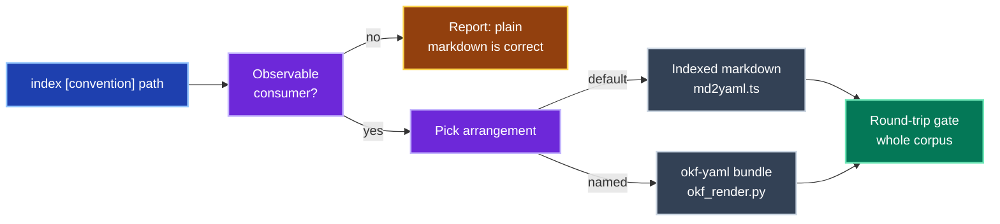

*A named convention skips the arrangement choice.*

Complete diagram: both arrangements end to end

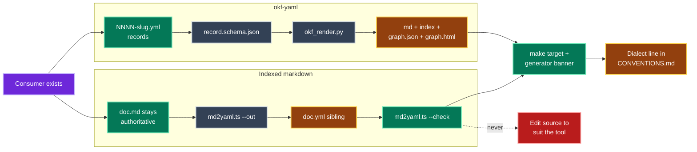

## 7. Permutations

The full product of mode, argument, dialect rung, repo state and index trigger is too large to run.
The evals cover every value of every axis at least once; the axis table and the scenario that covers each value live in [evals/README.md](evals/README.md#coverage).
