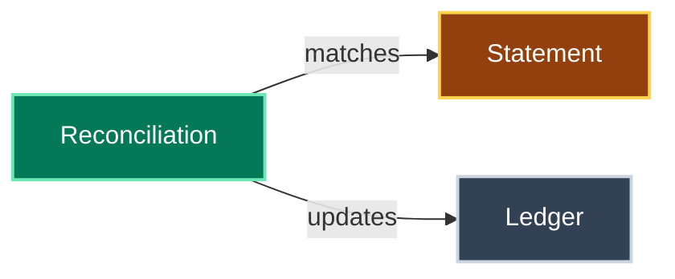

# Glossary

The ubiquitous language for `ledgerly`.
Each term is written in Title Case wherever it is used, to mark it as this glossary's meaning rather than the plain-language one.
When a new domain term enters the code or the conversation, add it here in the same change.
Give it its own H2 and a place in the diagram.

## Ledger

The internal record of every expected money movement.

## Reconciliation

Matching each Statement line to one Ledger entry.

## Statement

A bank's export of account movements for one period.
