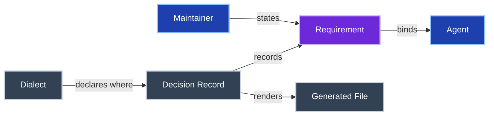

# Glossary template: the preferred shape of GLOSSARY.md

The format the librarian prefers for the ubiquitous language of a repo.
Init writes it; audit judges an existing GLOSSARY.md against it structurally, never its definitions (ADR-1).

Format is a **dialect line like any other** (SKILL.md, authority ladder).
A repo that has declared a different glossary shape in `docs/CONVENTIONS.md`, or consistently uses one, keeps it.

----

## The template

````markdown
# Glossary

The ubiquitous language for `<repo>`.
Each term is written in Title Case wherever it is used, to mark it as this glossary's meaning rather than the plain-language one.
When a new domain term enters the code or the conversation, add it here in the same change.
Give it its own H2 and a place in the diagram.



## Agent

An AI coding assistant working in this repo, such as Claude Code or Codex.
Every Agent is bound by the instructions in [AGENTS.md](AGENTS.md).

## Decision Record

One accepted decision in the ADR surface.
It is never rewritten, and a later Decision Record supersedes it through a typed relation.

## Dialect

This repo's declared documentation conventions, in [docs/CONVENTIONS.md](docs/CONVENTIONS.md).

## Generated File

A file rendered from a source by the repo's regenerate command, and never edited by hand.

## Maintainer

The owner of this repo.
Only the Maintainer states a Requirement.

## Requirement

Something the Maintainer has stated the project must do or must never do.
See [ADR-NNNN](adrs/NNNN-short-name.md).
````

----

## The rules of the shape

1. **Intro of four lines.** Names the repo, the Title Case rule, the same-change currency rule, and the "own H2 and a place in the diagram" rule.
2. **One relationship diagram** (`flowchart LR`) directly under the intro.
   Every term is one node, labelled with the term exactly as its H2 reads.
   Edges are short verb phrases (`owns`, `is a kind of`, `never does`); a dotted edge marks a prohibition.
3. **Node classes group terms by kind**, using the six `classDef` lines above: `people`, `info`, `rule`, `forbidden`, `pipeline`, `record`.
   Declare all six even when some are unused, so a new term never needs a new palette.
4. **One H2 per term, in alphabetical order.** The H2 is the canonical name in Title Case; no synonyms, no qualifiers.
5. **Definition first, one to three sentences.** Relations to other terms use their Title Case names.
   Where a Decision Record governs the term, end with a `See [ADR-…](…)` link.
6. **Seed terms.** Init seeds Agent, Decision Record, Dialect, Generated File, Maintainer and Requirement, then adds the repo's own domain terms.
   Drop a seed term only when the repo has no such concept.

## Audit findings

Structural only: none of these judges whether a definition is correct or complete.

| Finding | Severity |
|---|---|
| Intro missing the same-change currency rule | 🔴 |
| No relationship diagram | 🟡 |
| A term with an H2 but no diagram node, or a node with no H2 | 🟡 |
| Terms not in alphabetical order | 🟡 |
| Terms defined in a table, list or bold run instead of H2s | 🟡 |
