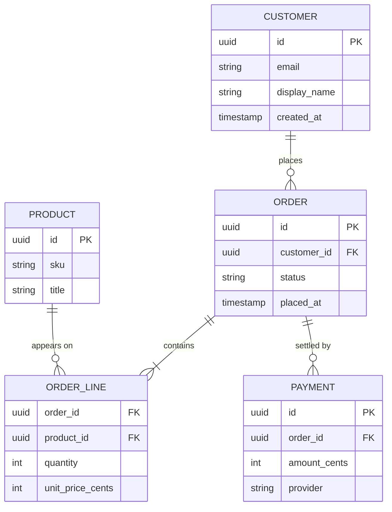

# Order data model

A customer places orders. Each order holds one or more lines, each line names a
catalogue product, and an order is settled by one or more payments.

```mermaid
erDiagram
    CUSTOMER ||--o{ ORDER : places
    ORDER ||--|{ ORDER_LINE : contains
    PRODUCT ||--o{ ORDER_LINE : "appears on"
    ORDER ||--o{ PAYMENT : "settled by"

    CUSTOMER {
        uuid id PK
        string email
        string display_name
        timestamp created_at
    }
    ORDER {
        uuid id PK
        uuid customer_id FK
        string status
        timestamp placed_at
    }
    ORDER_LINE {
        uuid order_id FK
        uuid product_id FK
        int quantity
        int unit_price_cents
    }
    PRODUCT {
        uuid id PK
        string sku
        string title
    }
    PAYMENT {
        uuid id PK
        uuid order_id FK
        int amount_cents
        string provider
    }
```
